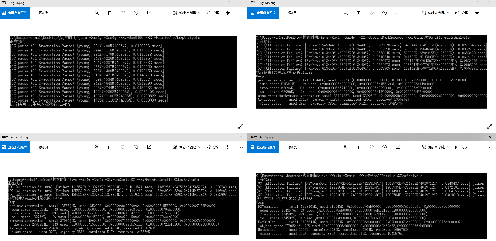
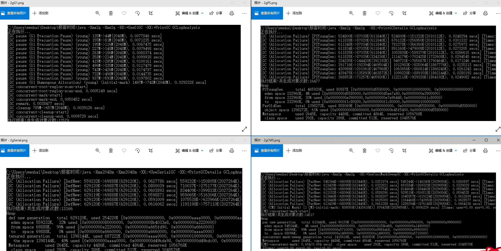
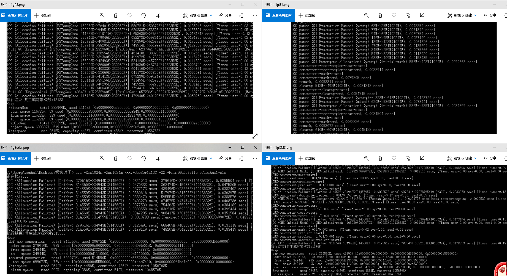

[TOC]

# 学习笔记

## 作业1

###  串行/并行/CMS/G1 垃圾收集器对比

#### 相同4g的Xmx,Xms参数设置下



#### 相同2g的Xmx,Xms参数设置下



#### 相同1g的Xmx,Xms参数设置下



##### 从以上图中可知：

1. 新生代足够大就不会触发 full gc，如果触发 full gc，相对堆空间越大时间越久
2. 每个垃圾收集器在没有设置 Xmn 都会按照各自比例设置年轻代、老年代的值
3. 堆空间越小，那么年轻代空间会小导致有大对象直接进入老年代，会频繁触发 full gc 
4. Serial 垃圾收集器比 ParNew/Parallel Scavenge 垃圾收集器回收时间长，因为 Serial 是单线程， ParNew/Parallel Scavenge 是多线。
   Parallel Old 垃圾收集器比 CMS 垃圾收集器回收时间长，因为 CMS 除了初始标记/重新标记的其他阶段业务线程可以与垃圾回收线程一起执行
5. CMS 比 G1 垃圾收集器回收时间长，G1 垃圾收集器采用全新的概念，是部分 + Region 垃圾收集器的代表。
    不回收所有区域，根据 GCMaxPauseMillis(默认200ms) 来控制
6. Serial 适合使用在小型客户端上，因为内存小停顿时间短。ParNew + CMS 适合多核低延迟，因为 CMS 是并发收集器。
   Parallel Scavenge + Parallel Old 适合高吞吐量，也是JDK 8 默认的垃圾收集器。
   G1 是部分垃圾收集器，可以做到比 CMS 还要低延迟! 暂停时间可以设置在合理的 50-100ms 内。


##  NIO 概念
1. Buffer: 在 NIO 库里面，所有数据都是用缓冲区处理(在面向流 I/O 中，可以将数据直接写入或者将数据直接读到 Stream 对象中)
2. Channel：网络数据通过 Channel 读入和写入。通道与流的不同之处在于通道是双向的，流只是一个方向上移动，而通道可以用于读、写或者二者同时进行

## Netty
### ChannelHandler 典型用途
1. 将数据从一种格式转换为另一种格式
2. 提供异常通知
3. 提供 Channel 变为活动的或者非活动的通知
4. 提供当 Channel 注册到 EventLoop 或者从 EventLoop 注销时的通知
5. 提供有关用户自定义事件的通知

### 选择器
选择器背后的基本概念是充当一个注册表，在那里你将可以请求在 Channel 的状态发生变化时得到通知，可能的状态变化有：
1. 新的 Channel 已被接受并且就绪
2. Channel 连接已经完成
3. Channel 有已经就绪的可供读取的数据
4. Channel 可用于写数据

### ByteBuf (Netty 的数据容器) ：
#### API 的优点
1. 它可以被用户自定义的缓冲区类型扩展
2. 通过内置的复合缓冲区类型实现了透明的零拷贝
3. 容量可以按需增长(类似于 JDK 的 StringBuilder)
4. 在读和写这两种模式之间切换不需要调用 ByteBuffer 的 flip()方法
5. 读和写使用了不同的索引
6. 支持方法的链式调用
7. 支持引用计数
8. 支持池化
#### 分类
1. 堆缓冲区：数据存储在 JVM 的对空间中。这种模式被称为支撑数组(backing array),它能在没有使用池化的情况下提供快速的分配和释放;
    ```
    io.netty.buffer.ByteBuf.hasArray();
    io.netty.buffer.ByteBuf.array();
    io.netty.buffer.ByteBuf.arrayOffset();
    
    ```
2. 直接缓冲区：NIO 在 JDK 1.4 中引入的 ByteBuffer 类允许 JVM 实现通过本地调用来分配内存。
   主要是为了避免在每次调用本地 I/O 操作之前 (或者之后) 将缓冲区的内容复制到一个中间缓冲区 (或者从中间缓冲区把内容复制到缓冲区) 
   直接缓冲区的主要缺点是，相对于基于堆的缓冲区，它们的分配和释放都较为昂贵。
   ```
    io.netty.buffer.ByteBuf.hasArray(); // 返回 false 不是支撑数组则这是一个直接缓冲区
   ```
   
3. 复合缓冲区：它为多个 ByteBuf 提供一个聚合视图

#### 方法调用细节
1. 读/写操作
    
